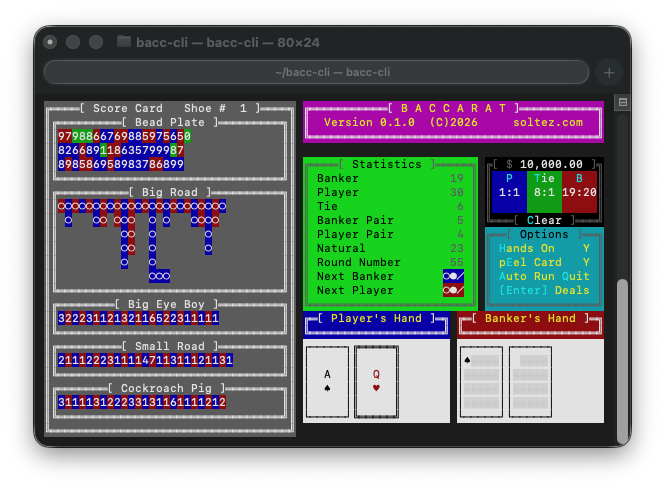

# bacc-cli

A terminal Baccarat game -- a faithful recreation of Raymond M. Buti's 1986 MS-DOS Baccarat, rebuilt in Rust.

Requires an 80x24 terminal.

## Gameplay

Each round follows standard Punto Banco rules. The game uses an 8-deck shoe.

**Placing a bet**

Before dealing, press `P`, `B`, or `T` to open a bet on Player, Banker, or Tie respectively. Type an amount and press `Enter` to confirm, or `Esc` to cancel.

**Playing a round**

Press `Enter` to deal and step through each card animation. The game auto-advances between non-interactive steps. Scores are shown once both hands are resolved.

**Shoe exhaustion**

When the shoe runs out, the scoreboard stays visible so you can review the results. Press `Enter` once to reset to a new shoe, adjust your bet if needed, then press `Enter` again to start dealing.

## Options

| Key | Option | Default |
|-----|--------|---------|
| `H` | Toggle card display on/off | On |
| `E` | Toggle corner/side peel animation | Off |
| `A` | Auto-run: enter a hand count, then `Enter` to start | - |
| `Q` / `Ctrl+C` | Quit | - |

**Auto-run** deals hands continuously until the requested count is reached or the shoe is exhausted. Press `Esc` while entering the count to cancel.

## Scoreboard

The scoreboard panel tracks the current shoe using standard Baccarat roads:

- **Bead Plate** - every outcome in sequence
- **Big Road** - runs of Banker and Player results
- **Big Eye Boy, Small Road, Cockroach Pig** - derived pattern roads

The statistics panel shows outcome counts, pair and natural frequencies, and derived road predictions for the next hand.
